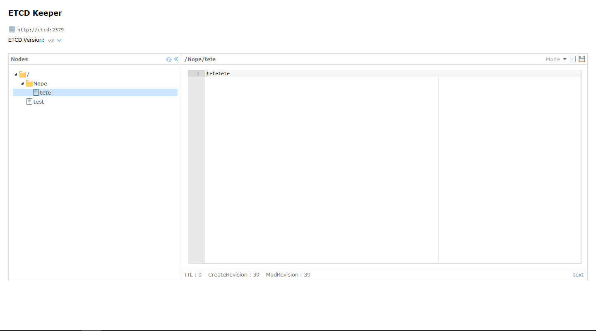

## etcdkeeper
* Lightweight etcd web client in Docker.
* Support etcd 2.x and etcd 3.x.
* Server using the grpc interface, the server needs to compile the package etcd clientv3.
* Based easyui framework to achieve(easyui license [easyui website](http://www.jeasyui.com)).

## Usage
1. Start the container executing: `docker run -p8080:8080 andrescc/etcdkeeper`
2. Open your browser and enter the address: http://127.0.0.1:8080
3. Right click on the tree node to add or delete.
4. Etcd address can be modified by default to the localhost. If you change, press the Enter key to take effect.

## Options
Following enviroment variables are available for change the etcdkeeper default configuration:
```
  HOST string  
        host name or ip address (default: "127.0.0.1", the http server addreess, not etcd address)
  PORT int
        port (default 8080)
```
**Example:** `docker run --env HOST=0.0.0.0 --env PORT=9090 -p9090:9090 andrescc/etcdkeeper`

## Features
* Etcd client view, Add, update or delete nodes.
* Content edits use the ace editor[(Ace editor)](https://ace.c9.io). Support toml,ini,yaml,json,xml and so on to highlight view.
* Content format. (Currently only support json, Other types can be extended later) Thanks jim3ma for his contribution.[@jim3ma]( https://github.com/jim3ma)

## Future Features
* Import and export.
* Content simple filter search.

## Special Note
Because the etcdv3 version uses the new storage concept, without the catalog concept, the client uses the previous default "/" delimiter to view. See the documentation for etcdv3 [clientv3 doc](https://godoc.org/github.com/coreos/etcd/clientv3).

## Screenshots


## License
MIT

## Original repository
[evildecay/etcdkeeper](https://github.com/evildecay/etcdkeeper) 